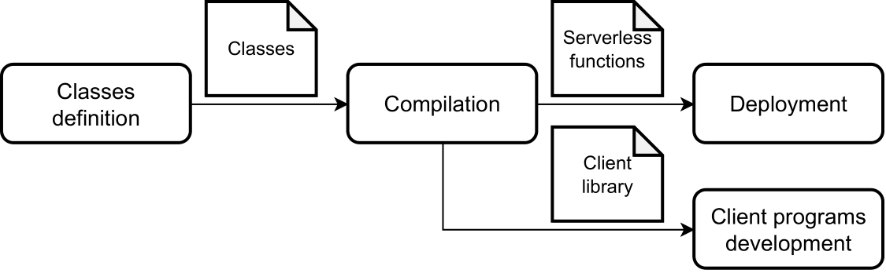

# Nubes

A library providing an abstraction layer built for the stateful serverless functions, that hides the intricacies of state management and serverless functions definitions and deployment. Specifically, Nubes is a **library** and **code generator** that allows to utilize object-oriented programming concepts while building stateful serverless applications. Developers are responsible only for the definitions of the object types representing the state, as well as methods designed for its state retrieval and modification. All of this is done without the need for explicit database interactions, as those are managed by Nubes. Moreover, based on the detected types, the corresponding serverless functions handlers with its necessary deployment files are automatically constructed.

**Goals**:

- accelerating development process of serverless applications
- hiding the details of state management in stateful serverless applications
  while using well-known concepts derived from object-oriented programming.

## Repository Structure

```none
├───.vscode         <- VSCode's launch.json for quick project launch.
├───evaluation      <- Case studies used for Nubes evaluation.
├───example         <- Example of a project developed with Nubes.
├───generator       <- Nubes code generator.
└───lib             <- Nubes library.
```

To see detailed descript of each directory, see the corresponding README in the directory.

## Prerequisites

Nubes requires **Golang version 1.18 or greater**.

To successfully run Nubes generator, [goimports](https://pkg.go.dev/golang.org/x/tools/cmd/goimports) must be installed.

To deploy serverless functions:

- [AWS credentials](https://docs.aws.amazon.com/cli/latest/userguide/cli-configure-quickstart.html) must be configured
- [serverless framework](https://www.serverless.com/framework/docs/getting-started) must be installed

Additionally, as one of the commands required for serverless functions deployemnt uses a bash script, Windows users need bash-emulating command-line (e.g. Git Bash usually installed along with Git for Windows).

## Usage example

To see an example of project developed with Nubes, see the code and README in the `example` directory. The high-level overview of the development workflow and the programming model details are described in the sections below. The details of the code generation done by the Nubes generator are described in the README in the `generator` directory.

## Programming model

### Development workflow



The development workflow of a Nubes application involves four phases illustrated in the figure above. The four steps are:

- **Types (classes) definition**: developers define the types of objects (classes) they use in their applications. Types are the blueprints for objects, which encapsulate state attributes) and behaviors (methods).
- **Compilation**: Nubes generator automatically translates
the types defined in the previous step into a form that can be deployed and executed in a serverless environment. This step produces server-side and client-side components.
  - **Server-side**: it produces the definitions of serverless functions handlers to be deployed in the serverless environment. Additionally, all the necessary files required for the deployment step are created.
  - **Client-side**: it produces a client's library, that contains a modified versions of the original classes so that the invocations of local methods are automatically converted into the invocations of corresponding serverless functions.
- **Deployment**: serverless functions are deployed onto the serverless environment and the storage service is initialized using the scripts produced in the previous step.
- **Client development**: developers import and use the classes defined in the client library to instantiate concrete objects and define the specific behavior of the application at hand.

### The basics of types definitions

The basic building block of Nubes projects are object types (aka classes). They represent state persisted by Nubes and expose methods for interactions with the state. A valid declaration of Nubes object type, must adhere to two specific requirements:

- it must include the `GetTypeName` method that returns a string used to determine the type's name
- it must contain an `Id` field or a `CustomId` field:
  - *default `Id` implementation:* the field must of type string and has a name `Id`.  In such cases, the field is automatically filled during the `Export` (method for saving the object for the first time) invocation on an object. The value of the field is a UUID that thereafter identifies the instance.
  - *custom `Id` implementation*: must be of type string, and be be annotated with a Golang tag, whose key is nubes, and value is id.
  Example:

  ```Go
  type User struct {
    FirstName          string
	  LastName           string
    Email              string `nubes:"id"`
  }
  ```

The string returned from `GetTypeName` method together with the `Id` field makes it possible to uniquely identify an instance of an object in Nubes application.

### Lifecycle management

### Getters and setters

### Methods

### Relationships

### Client's library

## Implementation details


## Limitations

TODO