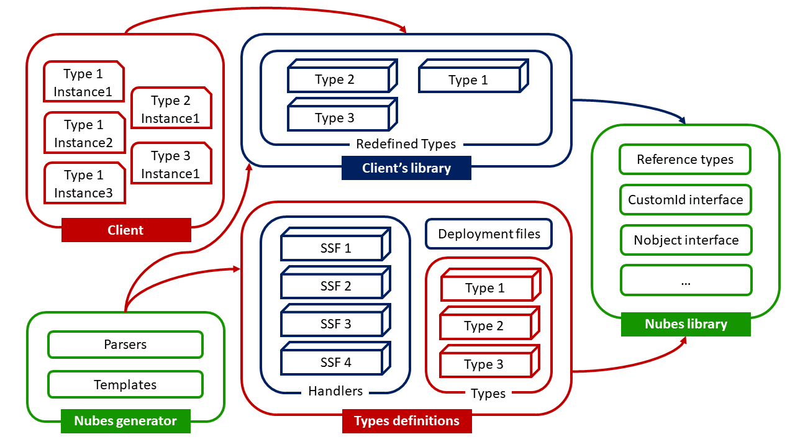

# Nubes

A library providing an abstraction layer built for the stateful serverless functions, that hides the intricacies of state management. Specifically, Nubes is a **library** and **code generator** that allows to utilize object-oriented programming concepts while building stateful serverless applications. Developers are responsible only for the definitions of the object types representing the state, as well as methods designed for its state retrieval and modification. All of this is done without the need for explicit database interactions, as those are managed by Nubes. Moreover, based on the detected types, the corresponding serverless functions handlers with its necessary deployment files are automatically constructed.

**Goals**:

- accelerating development process of serverless applications
- hiding the details of state management in stateful serverless applications
  while using well-known concepts derived from object-oriented programming.

## Repository Structure

```none
├───.vscode         <- VSCode's launch.json for quick project launch.
├───evaluation      <- Case studies used for Nubes evaluation.
├───example         <- Example of a project developed with Nubes.
├───generator       <- Nubes code generator.
└───lib             <- Nubes library.
```

## Prerequisites

Nubes requires **Golang version 1.18 or greater**.

To successfully run Nubes generator, [goimports](https://pkg.go.dev/golang.org/x/tools/cmd/goimports) must be installed.

To deploy serverless functions:

- [AWS credentials](https://docs.aws.amazon.com/cli/latest/userguide/cli-configure-quickstart.html) must be configured
- [serverless framework](https://www.serverless.com/framework/docs/getting-started) must be installed

Additionally, as one of the commands required for serverless functions deployemnt uses shell script, Windows users need bash-emulating command-line (e.g. Git Bash usually installed along with Git for Windows).

## Usage example

To see an example of project developed with Nubes, see the code and README in the `example` directory. The high-level overview of the development workflow and the programming model details are described in the sections below. The details of the code generation done by the Nubes generator are described in the readme in the `generator` directory.

## Programming model

The basic building block of Nubes projects are object types called Nobjects. They represent state persisted by the Nubes and expose methods for interactions with the state.  A valid declaration of Nubes object type, must adhere to several specific requirements:

- the `GetTypeName` method that returns a string used to determine the type's name
- the `Id` field of type string unless the implementation of custom Id field is provided

## Implementation details



## Limitations
